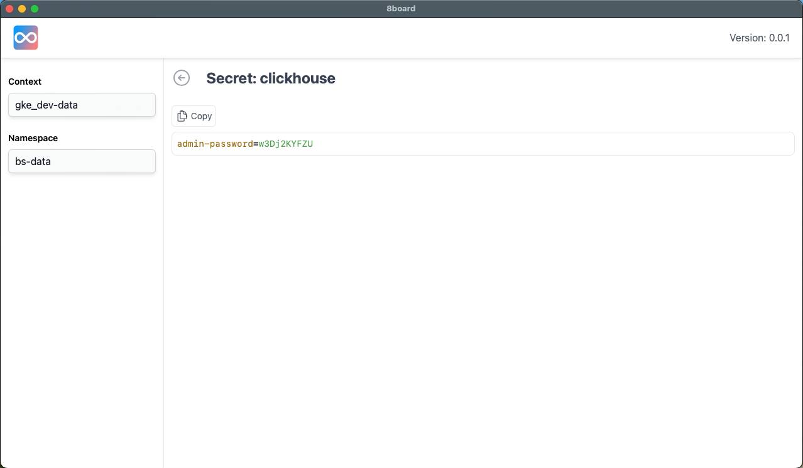

# 8board - Useful utilities working with kubernetes



## How to use

Clone the repo and compile it yourself.

## Requirements

- Have `golang` installed, version `^1.21`
- Have `yarn` installed
- Have [wails](https://wails.io/docs/gettingstarted/installation) cli installed.

## Development

```bash
yarn --cwd frontend install && yarn --cwd frontend build # Once time only

wails dev
```

## How to build

```bash
yarn --cwd frontend install && yarn --cwd frontend build # Once time only

wails build
```

Then you will find your Application inside folder `build/bin`

## Note

- To run the application, you need to have `kubectl` cli installed.
- If you have error while using the app, it might be it can not find the executable due to missing `$PATH`.
  Try editing `PATH` in config file `~/.8board/config.json`
